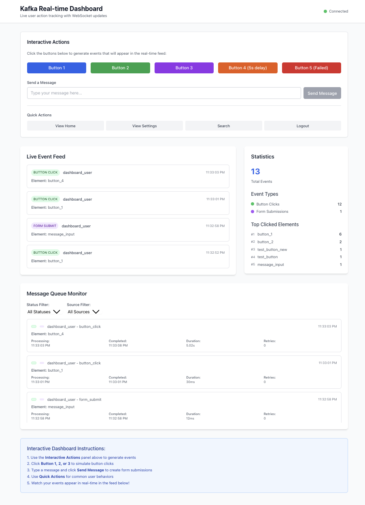

# Kafka Real-time Dashboard

A production-ready real-time user action tracking system built with **Kafka**, **Django**, **React**, and **TailwindCSS**. This dashboard provides live monitoring of user events with WebSocket updates and comprehensive analytics.

## 📸 Dashboard Preview



*Live dashboard showing real-time event tracking, queue monitoring, and interactive controls*

## 🚀 Features

### **Core Functionality**
- **Real-time Event Tracking**: Live user action monitoring with WebSocket updates
- **Interactive Event Generation**: Test buttons for different event types and delays
- **Batch Event Processing**: High-volume event generation for load testing
- **Queue Monitoring**: Real-time message processing status with timing data
- **Event Analytics**: Real-time statistics and top clicked elements

### **Production-Ready Kafka Integration**
- **Enterprise-Grade Producers**: Idempotent, durable, and ordered message delivery
- **Robust Consumers**: Manual offset commits, retry logic, and Dead Letter Queue (DLQ)
- **Scalable Architecture**: Multiple producers and consumers with load balancing
- **Consumer Groups**: Automatic partition assignment and fault tolerance
- **Smart Partitioning**: Even distribution across partitions using hash-based keys
- **Comprehensive Monitoring**: Prometheus-compatible metrics and health checks

### **Reliability & Safety**
- **Exactly-Once Semantics**: Idempotent producers with `acks=all`
- **At-Least-Once Delivery**: Manual offset commits with retry mechanisms
- **Fault Tolerance**: Exponential backoff retry logic with DLQ support
- **Graceful Shutdown**: Proper cleanup and resource management
- **Error Handling**: Comprehensive error tracking and structured logging

### **Technology Stack**
- **Django Channels**: WebSocket support for real-time communication
- **React Frontend**: Modern, responsive UI with TailwindCSS
- **PostgreSQL**: Production database with Redis caching
- **Docker Support**: Complete containerization for easy deployment
- **ASGI Server**: Daphne for production-ready async support

## 🏗️ Architecture

### **High-Level System Architecture**
```
┌─────────────────┐    ┌──────────────┐    ┌─────────────────┐
│   React App     │◄──►│  Django API  │◄──►│   PostgreSQL    │
│   (Frontend)    │    │  (Backend)   │    │   (Database)    │
└─────────────────┘    └──────────────┘    └─────────────────┘
         │                       │
         │              ┌──────────────┐
         │              │   WebSocket  │
         └──────────────►│   Channels   │
                        └──────────────┘
                                 │
                        ┌──────────────┐
                        │    Redis     │
                        │  (Channels)  │
                        └──────────────┘
```

### **Production-Ready Kafka Architecture**
```
┌─────────────────────────────────────────────────────────────────┐
│                    Kafka Cluster (3 Partitions)                │
│  ┌─────────────┐  ┌─────────────┐  ┌─────────────┐            │
│  │ Partition 0 │  │ Partition 1 │  │ Partition 2 │            │
│  └─────────────┘  └─────────────┘  └─────────────┘            │
└─────────────────────────────────────────────────────────────────┘
         ▲                    ▲                    ▲
         │                    │                    │
┌─────────────────┐  ┌─────────────────┐  ┌─────────────────┐
│   Producer 1    │  │   Producer 2    │  │   Producer 3    │
│ (Interactive)   │  │   (Batch)       │  │   (Custom)      │
│ Idempotent      │  │   High Volume   │  │   Load Testing  │
│ acks=all        │  │   Compression   │  │   Monitoring    │
└─────────────────┘  └─────────────────┘  └─────────────────┘

┌─────────────────────────────────────────────────────────────────┐
│                 Consumer Group (dashboard_consumer_group)       │
│  ┌─────────────┐  ┌─────────────┐  ┌─────────────┐            │
│  │ Consumer 1  │  │ Consumer 2  │  │ Consumer 3  │            │
│  │ Manual      │  │ Retry Logic │  │ DLQ Support │            │
│  │ Commits     │  │ Exponential │  │ Error       │            │
│  │ Fault       │  │ Backoff     │  │ Handling    │            │
│  │ Tolerance   │  │ Monitoring  │  │ Metrics     │            │
│  └─────────────┘  └─────────────┘  └─────────────┘            │
└─────────────────────────────────────────────────────────────────┘
```

## 📋 Prerequisites

- Python 3.11+
- Node.js 18+
- PostgreSQL (optional, SQLite used by default)
- Redis
- Apache Kafka (optional, mock mode available)

## 🛠️ Installation

### Option 1: Docker (Recommended)

1. **Clone the repository**
   ```bash
   git clone <repository-url>
   cd kafka-realtime-dashboard
   ```

2. **Start all services with Docker Compose**
   ```bash
   docker-compose up --build
   ```

   This will start:
   - PostgreSQL database
   - Redis for caching
   - Kafka and Zookeeper
   - Django backend
   - React frontend
   - Kafka consumer

3. **Access the application**
   - Frontend: http://localhost:3000
   - Backend API: http://localhost:8000
   - Admin Panel: http://localhost:8000/admin

### Option 2: Manual Setup

1. **Backend Setup**
   ```bash
   # Create virtual environment
   python -m venv venv
   source venv/bin/activate  # On Windows: venv\Scripts\activate

   # Install dependencies
   pip install -r requirements.txt

   # Run migrations
   python manage.py migrate

   # Create superuser (optional)
   python manage.py createsuperuser
   ```

2. **Frontend Setup**
   ```bash
   cd frontend
   npm install
   ```

3. **Start Services**

   **Terminal 1 - Django Backend:**
   ```bash
   python manage.py runserver
   ```

   **Terminal 2 - Kafka Consumer:**
   ```bash
   python manage.py consume_kafka
   ```

   **Terminal 3 - React Frontend:**
   ```bash
   cd frontend
   npm start
   ```

   **Terminal 4 - Event Producer (for testing):**
   ```bash
   python producer.py
   ```

## 🎯 Usage

### Event Producers

#### Interactive Producer
The `producer.py` script generates realistic user events for testing:

```bash
# Basic usage (60 seconds, 2-second intervals)
python producer.py

# Custom duration and interval
python producer.py --duration 300 --interval 1.0

# Continuous mode
python producer.py --continuous

# Mock mode (no Kafka required)
python producer.py --mock

# Custom Kafka settings
python producer.py --bootstrap-servers localhost:9092 --topic user_events
```

#### Batch Producer (Scalable)
The `producer_batch.py` script generates high-volume events for load testing:

```bash
# Batch mode (100 events)
python producer_batch.py --mode batch --batch-size 100

# Continuous mode (50 events/second for 60 seconds)
python producer_batch.py --mode continuous --events-per-second 50 --duration 60

# Custom settings
python producer_batch.py --bootstrap-servers localhost:9092 --topic user_events
```

### Scalable Consumer Management

```bash
# Start single consumer
python manage.py consume_kafka_scalable --consumer-id consumer-1

# Start multiple consumers with load balancing
python manage.py consume_kafka_scalable --consumer-id consumer-1 --consumer-group dashboard_consumer_group
python manage.py consume_kafka_scalable --consumer-id consumer-2 --consumer-group dashboard_consumer_group
python manage.py consume_kafka_scalable --consumer-id consumer-3 --consumer-group dashboard_consumer_group
```

### Kafka Topic Management

```bash
# Create topic with partitions
python manage_kafka.py --action create --topic user_events --partitions 3

# List topics
python manage_kafka.py --action list

# Delete topic
python manage_kafka.py --action delete --topic user_events
```

### API Endpoints

#### **Core Event APIs**
- `GET /api/events/latest/` - Get the latest 50 events with statistics
- `POST /api/events/create/` - Create new events from frontend actions
- `GET /api/queue/messages/` - Get message queue status
- `GET /api/queue/stats/` - Get queue statistics
- `WS /ws/events/` - WebSocket endpoint for real-time updates

#### **Production Monitoring APIs**
- `GET /api/health/` - System health check with component status
- `GET /api/metrics/` - Prometheus-compatible metrics and statistics
- `GET /api/consumer_metrics/` - Detailed consumer performance metrics

#### **Health Check Response**
```json
{
  "status": "healthy",
  "timestamp": "2025-01-16T10:30:00.000Z",
  "components": {
    "database": {
      "status": "healthy",
      "event_count": 1250,
      "queue_count": 1248
    },
    "kafka": {
      "status": "healthy",
      "bootstrap_servers": "kafka:9092",
      "topic": "user_events"
    }
  }
}
```

#### **Metrics Response**
```json
{
  "metrics": {
    "kafka_events_total": 1250,
    "kafka_events_recent_5min": 45,
    "kafka_queue_total": 1248,
    "kafka_queue_queued": 2,
    "kafka_queue_processing": 1,
    "kafka_queue_completed": 1245,
    "kafka_queue_failed": 0,
    "kafka_processing_time_avg_ms": 108.5,
    "kafka_event_types": {
      "button_click": 450,
      "page_view": 380,
      "form_submit": 200,
      "user_login": 120,
      "api_call": 100
    }
  },
  "prometheus_format": "kafka_events_total 1250\nkafka_queue_completed 1245\n..."
}
```

### Event Types

The system tracks various types of user events:

1. **page_view** - User visits a page
2. **button_click** - User clicks a button (Button 1, 2, 3, 4, 5)
3. **form_submit** - User submits a form (Send Message)
4. **Custom events** - With configurable delays and failure simulation

### Event Format

```json
{
  "user_id": "user_001",
  "event_type": "button_click",
  "element_id": "btn_submit",
  "timestamp": "2024-01-15T10:30:00Z"
}
```

## 🔧 Configuration

### Environment Variables

Copy `env.example` to `.env` and configure:

```bash
# Django Settings
SECRET_KEY=your-secret-key-here
DEBUG=True
ALLOWED_HOSTS=localhost,127.0.0.1

# Database (for production)
DB_NAME=kafka_dashboard
DB_USER=postgres
DB_PASSWORD=your-password
DB_HOST=localhost
DB_PORT=5432

# Redis
REDIS_URL=redis://localhost:6379

# Kafka
KAFKA_BOOTSTRAP_SERVERS=localhost:9092
KAFKA_TOPIC_USER_EVENTS=user_events

# Celery
CELERY_BROKER_URL=redis://localhost:6379/0
CELERY_RESULT_BACKEND=redis://localhost:6379/0
```

### Database Configuration

By default, the system uses SQLite for development. For production, uncomment the PostgreSQL configuration in `settings.py`:

```python
DATABASES = {
    'default': {
        'ENGINE': 'django.db.backends.postgresql',
        'NAME': config('DB_NAME', default='kafka_dashboard'),
        'USER': config('DB_USER', default='postgres'),
        'PASSWORD': config('DB_PASSWORD', default=''),
        'HOST': config('DB_HOST', default='localhost'),
        'PORT': config('DB_PORT', default='5432'),
    }
}
```

## 🏭 Production-Ready Features

### **Kafka Producer Best Practices**
- ✅ **Idempotence**: `enable.idempotence=true` for exactly-once semantics
- ✅ **Durability**: `acks=all` with increased retries (10) for reliability
- ✅ **Order Preservation**: `max.in.flight.requests.per.connection=1`
- ✅ **Smart Partitioning**: MD5 hash of `user_id:event_type` for even distribution
- ✅ **Performance**: Snappy compression, batching, and optimized timeouts
- ✅ **Graceful Shutdown**: Proper flush with 30-second timeout
- ✅ **Data Validation**: Event structure validation before sending

### **Kafka Consumer Best Practices**
- ✅ **Manual Offset Commits**: `enable.auto.commit=false` for at-least-once delivery
- ✅ **Retry Logic**: Exponential backoff with jitter (3 max retries)
- ✅ **Dead Letter Queue**: Failed messages sent to DLQ after max retries
- ✅ **Consumer Groups**: Load balancing with automatic partition assignment
- ✅ **Enhanced Metrics**: Comprehensive monitoring and error tracking
- ✅ **Graceful Shutdown**: Proper cleanup of consumers and DLQ producers
- ✅ **Error Handling**: Robust error handling with detailed logging

### **Monitoring & Observability**
- ✅ **Health Checks**: Real-time system component status
- ✅ **Prometheus Metrics**: Production-ready monitoring integration
- ✅ **Structured Logging**: JSON-formatted logs with correlation IDs
- ✅ **Performance Metrics**: Processing times, error rates, throughput
- ✅ **Alerting Ready**: Metrics compatible with Grafana and Prometheus

### **Reliability & Safety**
- ✅ **Exactly-Once Semantics**: Idempotent producers prevent duplicate processing
- ✅ **At-Least-Once Delivery**: Manual commits ensure no message loss
- ✅ **Fault Tolerance**: Automatic retry with exponential backoff
- ✅ **Circuit Breaker**: DLQ for consistently failing messages
- ✅ **Resource Management**: Proper cleanup and connection pooling

## 🧪 Testing

### Manual Testing

1. Start all services
2. Run the event producer: `python producer.py`
3. Open the dashboard at http://localhost:3000
4. Watch events appear in real-time

### API Testing

```bash
# Get latest events
curl http://localhost:8000/api/events/latest/

# Test health check
curl http://localhost:8000/api/health/

# Get metrics
curl http://localhost:8000/api/metrics/

# Test WebSocket connection
wscat -c ws://localhost:8000/ws/events/
```

### Load Testing

```bash
# High-volume batch testing
python producer_batch.py --mode continuous --events-per-second 100 --duration 300

# Multiple consumer testing
python manage.py consume_kafka_scalable --consumer-id load-test-1 --consumer-group test_group
python manage.py consume_kafka_scalable --consumer-id load-test-2 --consumer-group test_group
```

## 📊 Dashboard Features

### Real-time Event Feed
- Live stream of user events
- Color-coded event types
- Timestamp display
- Auto-scrolling feed

### Statistics Panel
- Total event count
- Event type breakdown
- Top clicked elements
- Real-time updates

### Connection Status
- WebSocket connection indicator
- Error handling and reconnection
- Connection status display

## 🚀 Production Deployment

### Using Docker

1. **Build and deploy**
   ```bash
   docker-compose -f docker-compose.prod.yml up -d
   ```

2. **Set up reverse proxy (nginx)**
   ```nginx
   server {
       listen 80;
       server_name your-domain.com;

       location / {
           proxy_pass http://localhost:3000;
       }

       location /api/ {
           proxy_pass http://localhost:8000;
       }

       location /ws/ {
           proxy_pass http://localhost:8000;
           proxy_http_version 1.1;
           proxy_set_header Upgrade $http_upgrade;
           proxy_set_header Connection "upgrade";
       }
   }
   ```

### Manual Production Setup

1. **Configure production settings**
   - Set `DEBUG=False`
   - Configure PostgreSQL
   - Set up Redis
   - Configure Kafka cluster

2. **Use a process manager (PM2, systemd)**
   ```bash
   # Start Django with Gunicorn
   gunicorn dashboard_backend.wsgi:application --bind 0.0.0.0:8000

   # Start Celery worker
   celery -A dashboard_backend worker --loglevel=info

   # Start Kafka consumer
   python manage.py consume_kafka
   ```

## 🔍 Monitoring

### Health Checks

- **Backend**: `GET /api/health/`
- **Database**: Django admin panel
- **Redis**: `redis-cli ping`
- **Kafka**: `kafka-topics --bootstrap-server localhost:9092 --list`

### Logs

- Django logs: `python manage.py runserver --verbosity=2`
- Kafka consumer logs: Check console output
- Docker logs: `docker-compose logs -f [service-name]`

## 🤝 Contributing

1. Fork the repository
2. Create a feature branch: `git checkout -b feature-name`
3. Make your changes
4. Add tests if applicable
5. Commit your changes: `git commit -am 'Add feature'`
6. Push to the branch: `git push origin feature-name`
7. Submit a pull request

## 📝 License

This project is licensed under the MIT License - see the LICENSE file for details.

## 🆘 Troubleshooting

### Common Issues

#### **WebSocket & Real-time Issues**
1. **WebSocket connection failed**
   - Check if Django Channels is running with Daphne
   - Verify Redis is accessible: `redis-cli ping`
   - Check CORS settings in Django settings
   - Verify WebSocket URL: `ws://localhost:8000/ws/events/`

#### **Kafka & Message Processing Issues**
2. **Kafka consumer not receiving messages**
   - Verify Kafka is running: `docker-compose ps kafka`
   - Check topic exists: `kafka-topics --bootstrap-server localhost:9092 --list`
   - Check consumer group: `kafka-consumer-groups --bootstrap-server localhost:9092 --list`
   - Verify consumer logs: `docker-compose logs kafka-consumer-1`
   - Check partition assignment: Look for "assigned partitions" in consumer logs

3. **Messages stuck in queue**
   - Check consumer health: `curl http://localhost:8000/api/health/`
   - Verify consumer metrics: `curl http://localhost:8000/api/consumer_metrics/`
   - Check for processing errors in consumer logs
   - Verify DLQ topic exists for failed messages

#### **Database & Storage Issues**
4. **Database connection issues**
   - Check PostgreSQL is running: `docker-compose ps postgres`
   - Verify database credentials in environment variables
   - Run migrations: `python manage.py migrate`
   - Check database logs: `docker-compose logs postgres`

#### **Frontend & API Issues**
5. **Frontend not loading**
   - Check if React dev server is running: `npm start`
   - Verify API URL configuration in `.env`
   - Check browser console for errors
   - Test API endpoints: `curl http://localhost:8000/api/health/`

#### **Production & Performance Issues**
6. **High memory usage**
   - Check consumer batch sizes and polling intervals
   - Monitor metrics endpoint for processing times
   - Verify proper cleanup in consumer shutdown
   - Check for memory leaks in WebSocket connections

7. **Slow message processing**
   - Check consumer metrics for processing times
   - Verify partition distribution across consumers
   - Monitor Kafka cluster performance
   - Check for network latency between services

### Health Check Commands

```bash
# System health
curl http://localhost:8000/api/health/

# Detailed metrics
curl http://localhost:8000/api/metrics/

# Consumer status
docker-compose logs kafka-consumer-1 --tail=20

# Kafka topic status
docker-compose exec kafka kafka-topics --bootstrap-server localhost:9092 --describe --topic user_events

# Consumer group status
docker-compose exec kafka kafka-consumer-groups --bootstrap-server localhost:9092 --describe --group dashboard_consumer_group
```

### Getting Help

- Check the logs for error messages with structured logging
- Verify all services are running with health checks
- Test individual components separately using API endpoints
- Check network connectivity between services
- Monitor metrics and performance indicators
- Use the monitoring endpoints for real-time diagnostics

## 🎉 Success!

If everything is working correctly, you should see:

### **Core System Status**
1. ✅ Django backend running on port 8000 with Daphne ASGI server
2. ✅ React frontend running on port 3000 with real-time updates
3. ✅ WebSocket connection established and stable
4. ✅ Events appearing in real-time on the dashboard
5. ✅ Statistics updating automatically with live data

### **Production-Ready Features**
6. ✅ Kafka producers with idempotence and durability (`acks=all`)
7. ✅ Consumers with manual offset commits and retry logic
8. ✅ Health checks returning `"status": "healthy"` at `/api/health/`
9. ✅ Prometheus-compatible metrics at `/api/metrics/`
10. ✅ Consumer groups with automatic partition assignment
11. ✅ Dead Letter Queue for failed message handling
12. ✅ Comprehensive monitoring and structured logging

### **Performance Indicators**
- **Processing Time**: < 200ms average (check `/api/metrics/`)
- **Queue Status**: Minimal queued messages, high completion rate
- **Error Rate**: < 1% (monitor via metrics endpoint)
- **Throughput**: Stable event processing across all consumers
- **Memory Usage**: Stable with proper cleanup and resource management

Enjoy your real-time user action tracking dashboard! 🚀
